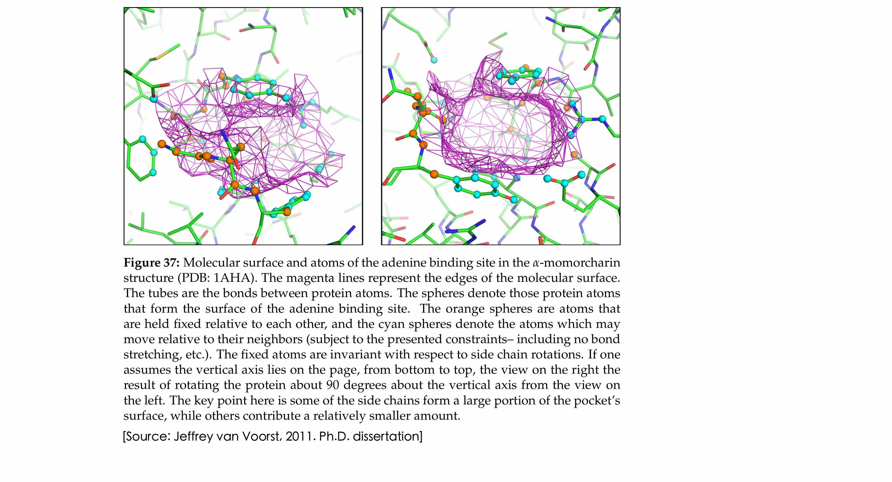
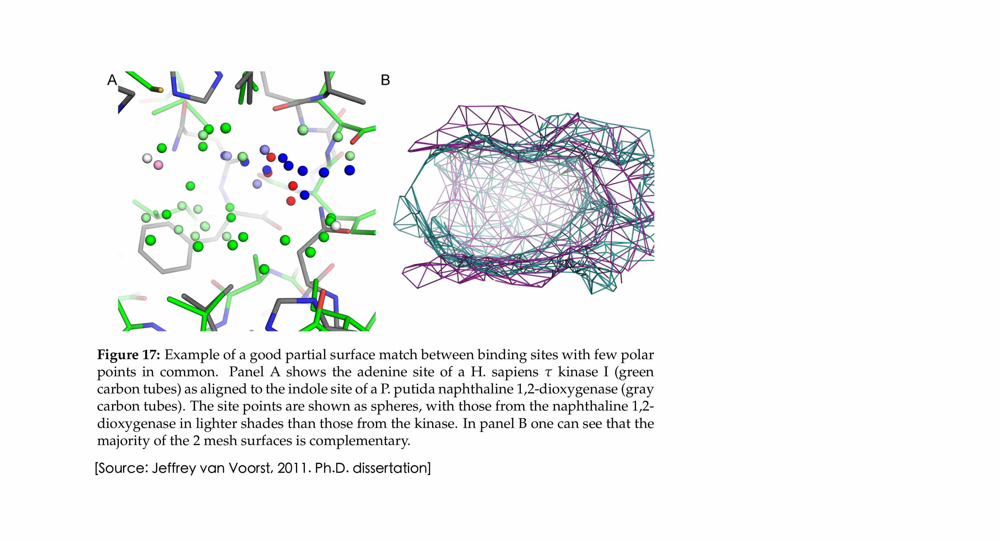

# SimSite3D

## Introduction

The SimSite3D Software tools are designed to quickly search a database of three dimensional structures, in Protein Data Bank format, with protein-ligand binding sites to determine which binding sites in the database have steric and chemical similarities to the query binding site. To realize this goal, SimSite3D performs some offline computations for each protein-ligand binding site, and the actual searches make use of the precomputed representation of the database binding sites.

More particularly, SimSite3D makes use of protein-ligand binding site sitemaps. A sitemap is computed from a user specified volume and protein coordinate file (in PBD format). Sitemaps contain the computed positions of favorable interaction in the ligand binding volume. The computed positions are those from which good hydrogen bonds or hydrophobic interactions can be made with the protein. Because SimSite3D was designed and tested on protein-ligand binding sites, the sitemap volume should contain the volume of interest that could be occupied by potential binders.

After one or more sitemaps is built, a sitemap may be used to query a database of sitemaps for binding sites that are significantly similar to the query binding site. During a database search, the best 3D alignment is determined between each database sitemap and the query sitemap. The top scoring alignments are saved in a user specified directory. Besides searching a database, one has the option of performing a comparison between two sitemaps.
SimSite3D can be used without computing alignments, that is, SimSite3D can also score user-provided alignments. Thus, the database proteins, ligands, and sitemaps are all assumed to be aligned with respect to the query protein, ligand, and sitemap. Finally, the methods SimSite3D uses to compare binding sites are computationally comparable to protein-ligand docking methods and require similar computational resources.

SimSite3D was developed by Jeffrey Van Voorst and Leslie A. Kuhn in the [PSA Lab](http://www.kuhnlab.bmb.msu.edu) at Michigan State University.

## Installing and Using SimSite3D

For more information on how to install and use SimSite3D, please refer to the 
SimSite3D documentation at

**https://psa-lab.github.io/SimSite3D/index.html**

In addition, additional documents are provided in the [doc](./doc) subdirectory that may be helpful:

- [Jeffrey Van Voorst's Ph.D. thesis explaining the theory behind SimSite3D](doc/Jeff_VanVoorst_MSU_PhD_dissertation_SimSite3D.pdf)
- [SimSite3D v 3.0 Software Installation Guide](./doc/SimSite3D_Install_Guide.pdf) (also applies to newer versions of SimSite3D)
- [Troubleshooting Guide](troubleshooting.md)
- [Simsite3D v 3.0 User Guide](./doc/SimSite3D_User_Guide.pdf)
- [SimSite3D gen_points reference sheet](./doc/SimSite3D-gen_points-ref-sheet.pdf)
- [SimSite3D search_sitemaps reference sheet](./doc/SimSite3D-search_sitemaps-ref-sheet.pdf)

